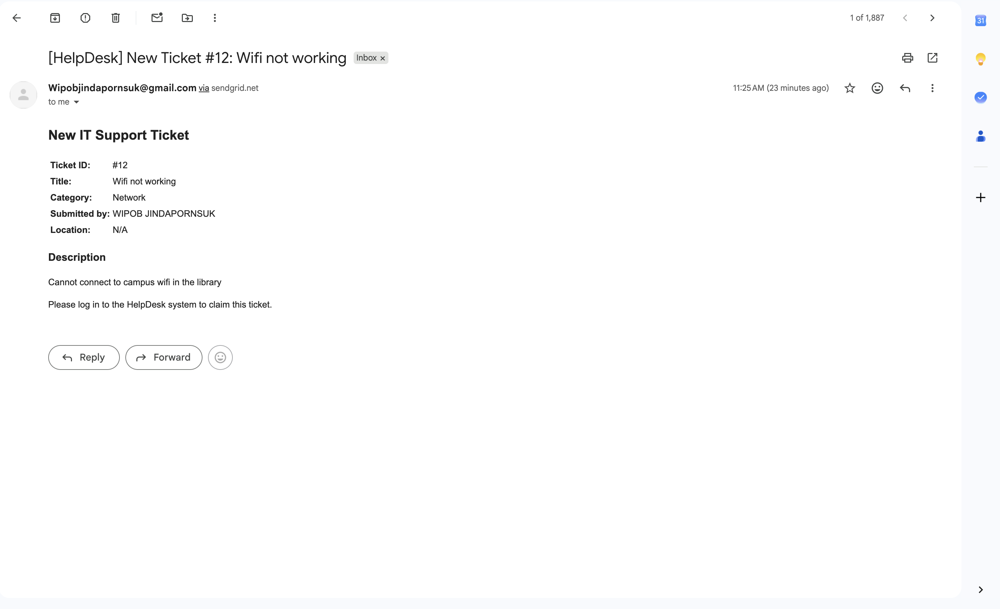
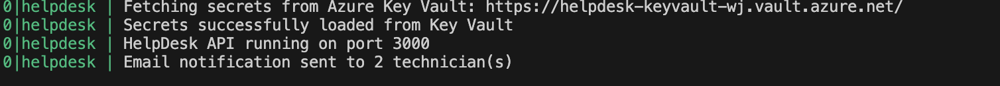

# HelpDesk: Internal Campus IT Ticketing System

A university IT support portal where students and faculty log in with their Microsoft Entra ID (Active Directory) credentials to submit tickets, and technicians claim and resolve them. Tickets are automatically categorized using Google Gemini, and new tickets trigger a SendGrid email notification to technicians.

Live deployment: https://helpdesk-badproject1.duckdns.org/helpdesk/

GitHub repository: https://github.com/WipobJind/HelpDesk_BADPROJECT1

## Overview

HelpDesk streamlines internal IT support for a university environment. Requesters submit tickets describing an issue, the system classifies the issue by category using an AI model, and technicians manage the resulting queue through role based access controls. All authentication is handled through the university's identity provider rather than a custom login system, and all production credentials are managed through a centralized secrets vault rather than local configuration files.

## Architecture

```
Client (browser or curl/Postman)
        |
        v
Nginx (reverse proxy, /helpdesk path, TLS via Let's Encrypt)
        |
        v
Express REST API (Node.js)
        |
        +--> Static frontend (public/index.html), served at /helpdesk/
        +--> Authentication: Microsoft Entra ID (MSAL), app issued JWT (roles: STUDENT, FACULTY, TECHNICIAN, ADMIN)
        +--> Prisma ORM, connected to MySQL (Users, Tickets, Categories, TicketUpdates)
        +--> Google Gemini API, categorizes ticket text on creation
        +--> SendGrid API, sends technician notifications on ticket creation
        +--> Azure Key Vault, provides database credentials, JWT signing secret, and API keys
             at runtime via the host's Managed Identity
```

## Feature Summary

| Area | Implementation |
|---|---|
| Hosting | Hardened Linux VM (Ubuntu 24.04 LTS) on Azure |
| Reverse proxy and TLS | Nginx with a dedicated URL path, Let's Encrypt certificate, automatic HTTP to HTTPS redirect |
| Backend | Node.js and Express REST API |
| Data layer | MySQL, managed through Prisma ORM with versioned migrations |
| Identity and access | JWT based sessions with role based access control, backed by the university's Active Directory tenant through MSAL |
| Secrets management | Azure Key Vault, accessed via the host's Managed Identity, no runtime secrets stored in source or configuration files |
| Third party integrations | Google Gemini (ticket classification) and SendGrid (email notifications) |
| Source control | GitHub, with commit history reflecting incremental development |
| Process management | PM2, configured to recover from crashes and restart automatically after a host reboot |

## Third Party Integrations

This project integrates two independent external services to extend the backend's business logic:

* **Google Gemini API** classifies each ticket's free text description into a category (Hardware, Software, Network, Account, or Other) at the moment of creation, so tickets are automatically routed without manual tagging.
* **SendGrid API** sends an email notification to the assigned technician group whenever a new ticket is created.

A note on verifying SendGrid delivery: notifications are addressed to whichever account currently holds the technician role in the database (configured for demonstration purposes). Anyone testing independently without access to that inbox can confirm the integration executed successfully by checking the application logs (`pm2 logs helpdesk-api`) for a line similar to `Email notification sent to X technician(s)`, or by reviewing the Activity Feed in the SendGrid dashboard.

**SendGrid delivery evidence:**

Application log confirming the notification was sent:



Notification email as received in the technician's inbox:



## Authentication Flow

Authentication is handled entirely through Microsoft Entra ID using MSAL Node; there are no local email and password accounts.

1. `GET /helpdesk/api/auth/login` redirects the user to Microsoft's sign in page.
2. The user authenticates with their university account. Any account within the organization's tenant is accepted.
3. Microsoft redirects back to `GET /helpdesk/api/auth/callback` with an authorization code.
4. The backend exchanges that code for the user's identity, then finds or creates a matching `User` record keyed on their Active Directory object ID, and issues the application's own signed JWT.
5. The backend redirects to the frontend with the token attached, and the frontend immediately stores it in local storage and clears it from the visible URL. Clients testing the API directly (curl or Postman) can retrieve the token from browser developer tools, described below.

New accounts default to the STUDENT role. Elevating an account to TECHNICIAN or ADMIN currently requires direct database access, described in the testing section.

## Testing the Live Deployment

### Network note

This deployment uses a free dynamic DNS domain (helpdesk-badproject1.duckdns.org). Some networks, including certain university WiFi networks, block or reset connections to dynamic DNS domains as a matter of firewall policy. If the live URL is unreachable on a given network, try mobile data or an alternate connection; the deployment itself has been verified to respond correctly directly from the host, so an unreachable URL under these conditions reflects a network level restriction rather than an application fault.

### Option A: Web interface

1. Visit https://helpdesk-badproject1.duckdns.org/helpdesk/
2. Select "Login with Microsoft" and authenticate with any account on the university's tenant.
3. Submit a ticket and observe the category assigned automatically.
4. Accounts elevated to TECHNICIAN or ADMIN will also see claim and status update controls on each ticket.

### Option B: Direct API access (curl or Postman)

Because Active Directory login is a browser based redirect flow, it cannot be completed from curl or Postman alone. Obtain a token through the browser first, then use it for subsequent requests.

1. Open https://helpdesk-badproject1.duckdns.org/helpdesk/api/auth/login in a browser and sign in. After landing on the frontend, open developer tools (F12), select the Console tab, and run:
```
localStorage.getItem("token")
```
Copy the returned value, excluding the surrounding quotation marks.

2. Retrieve the current user's profile:
```
curl https://helpdesk-badproject1.duckdns.org/helpdesk/api/auth/me -H "Authorization: Bearer YOUR_TOKEN"
```

3. Create a ticket:
```
curl -X POST https://helpdesk-badproject1.duckdns.org/helpdesk/api/tickets -H "Content-Type: application/json" -H "Authorization: Bearer YOUR_TOKEN" -d '{"title":"Wifi not working","description":"Cannot connect to campus wifi in the library"}'
```

4. List tickets:
```
curl https://helpdesk-badproject1.duckdns.org/helpdesk/api/tickets -H "Authorization: Bearer YOUR_TOKEN"
```

5. Claim a ticket (requires TECHNICIAN or ADMIN):
```
curl -X PATCH https://helpdesk-badproject1.duckdns.org/helpdesk/api/tickets/TICKET_ID/claim -H "Authorization: Bearer YOUR_TOKEN"
```

6. Update a ticket's status (requires TECHNICIAN or ADMIN):
```
curl -X PATCH https://helpdesk-badproject1.duckdns.org/helpdesk/api/tickets/TICKET_ID/status -H "Content-Type: application/json" -H "Authorization: Bearer YOUR_TOKEN" -d '{"status":"IN_PROGRESS"}'
```

Note: a user's role is embedded in their JWT at the time it is issued and is not re evaluated against the database on subsequent requests. If a role changes after a token has already been issued, the affected user must sign out and sign back in to receive a token reflecting the update.

## Secrets Management

No production secrets are stored in `.env`. At startup, `app.js` invokes `services/keyvault.js`, which authenticates to Azure Key Vault using the host's system assigned Managed Identity and retrieves the database connection string, JWT signing secret, Gemini API key, SendGrid API key, sender address, and the Active Directory client secret. A local `.env` file is used only as a development fallback when `AZURE_KEY_VAULT_URL` is not configured.

## Local Development Setup

1. Install dependencies: `npm install`
2. Copy `.env.example` to `.env` and populate a local MySQL connection string, JWT secret, and Gemini/SendGrid keys.
3. Apply migrations: `npx prisma migrate dev`
4. Start the server: `npm start`
5. Visit `http://localhost:3000/helpdesk/`, or confirm the service is running via `GET /helpdesk/api/health`

## Deployment Details

* **Infrastructure**: Azure virtual machine (Ubuntu 24.04 LTS), firewalled with UFW to expose only SSH, HTTP, and HTTPS.
* **Process management**: PM2, configured to restart automatically on failure and on host reboot via `pm2 startup` and `pm2 save`.
* **Reverse proxy**: Nginx, routing the `/helpdesk` path to the Node application on port 3000.
* **Domain**: A free DuckDNS subdomain, since Let's Encrypt certificate issuance requires a domain name rather than a bare IP address.
* **TLS**: Let's Encrypt via Certbot, with HTTP requests automatically redirected to HTTPS.
* **Secrets**: Azure Key Vault, accessed through the virtual machine's Managed Identity.

## Roles and Permissions

* **STUDENT / FACULTY**: submit tickets, view and comment on their own tickets.
* **TECHNICIAN**: view all tickets, claim tickets, update ticket status.
* **ADMIN**: full access, including technician account management.

## Data Model

Defined in `prisma/schema.prisma`:
* **User**: unique identifier, Active Directory object ID, name, email, role.
* **Ticket**: title, description, status, priority, room location, and relations to its requester, assigned technician, and category.
* **Category**: populated automatically based on Gemini's classification of ticket content.
* **TicketUpdate**: an audit trail of comments and status changes on a ticket.

## Service Integration Scope

This project satisfies its external integration requirement through two independent third party APIs, Google Gemini and SendGrid, as described above. A peer to peer service integration with another team's API was not implemented for this project; that scope was addressed instead through the two integrations documented here.
